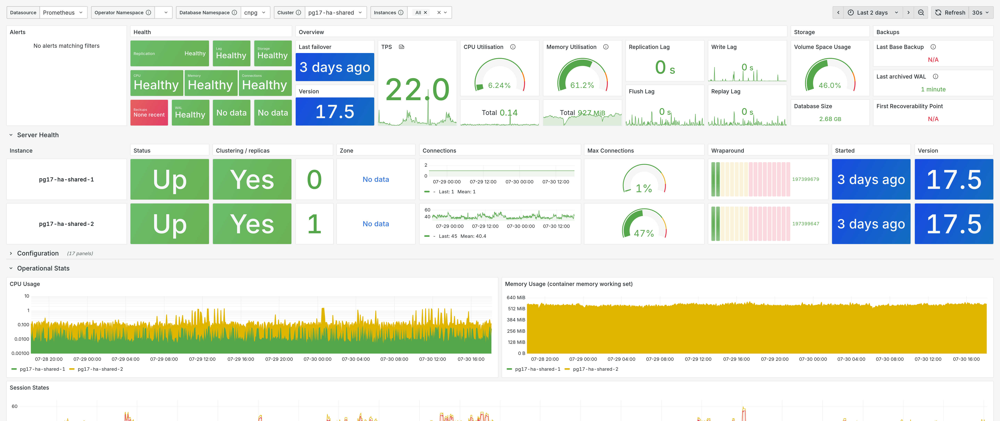

# CloudNativePG Mixin

A monitoring mixin for [CloudNativePG](https://cloudnative-pg.io), providing Grafana dashboards and Prometheus alerting rules for PostgreSQL clusters running on Kubernetes.

## Dashboards

This mixin bundles the [Grafana dashboard provided by CloudNativePG](https://github.com/cloudnative-pg/grafana-dashboards/blob/cececeb393fb7c5400b4fa290aca68041293a127/charts/cluster/grafana-dashboard.json).

<picture>
  <source media="(prefers-color-scheme: dark)" srcset="images/dashboard-dark.png">
  <source media="(prefers-color-scheme: light)" srcset="images/dashboard-light.png">
  
</picture>

## Prometheus Alerts

This mixin bundles the sample [Prometheus Alert rules provided by CloudNativePG](https://github.com/cloudnative-pg/cloudnative-pg/blob/b7e9f07cf6fa2181bc5c9b8e82d4b37b27ee92ba/docs/src/samples/monitoring/alerts.yaml).

- `LongRunningTransaction`: A query is taking longer than 5 minutes.
- `BackendsWaiting`: If a backend is waiting for longer than 5 minutes
- `PGDatabase`: Number of transactions from the frozen XID to the current one
- `PGReplication`: The standby is lagging behind the primary
- `LastFailedArchiveTime`: Checks the last time archiving failed. Will be < 0 when it has not failed.
- `DatabaseDeadlockConflicts`: Checks the number of database conflicts
- `ReplicaFailingReplication`: Checks if the replica is failing to replicate
