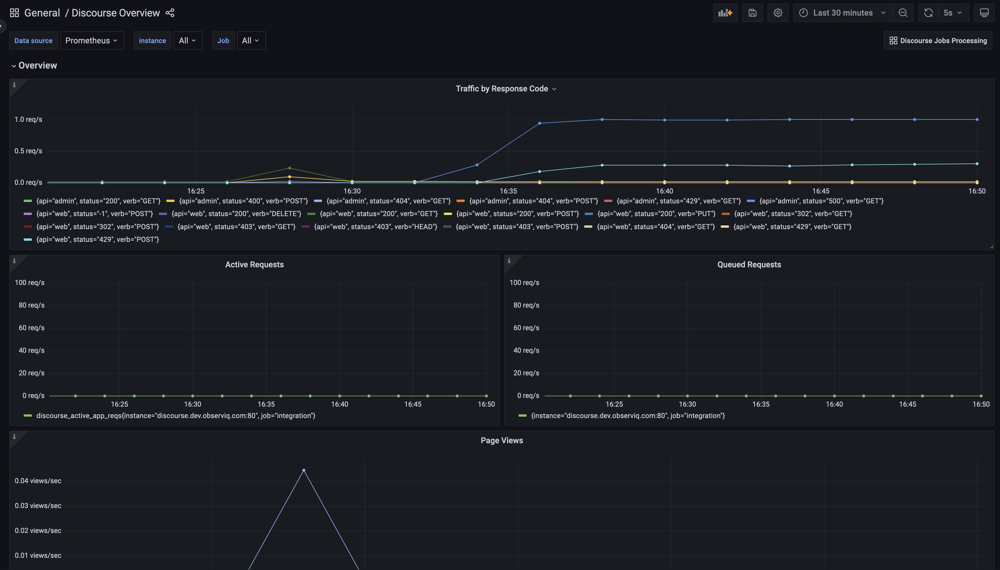
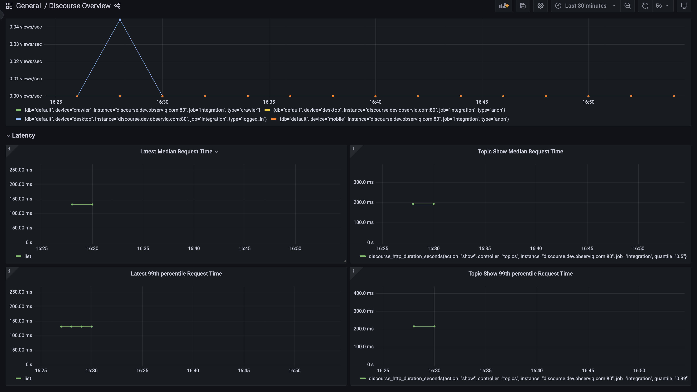
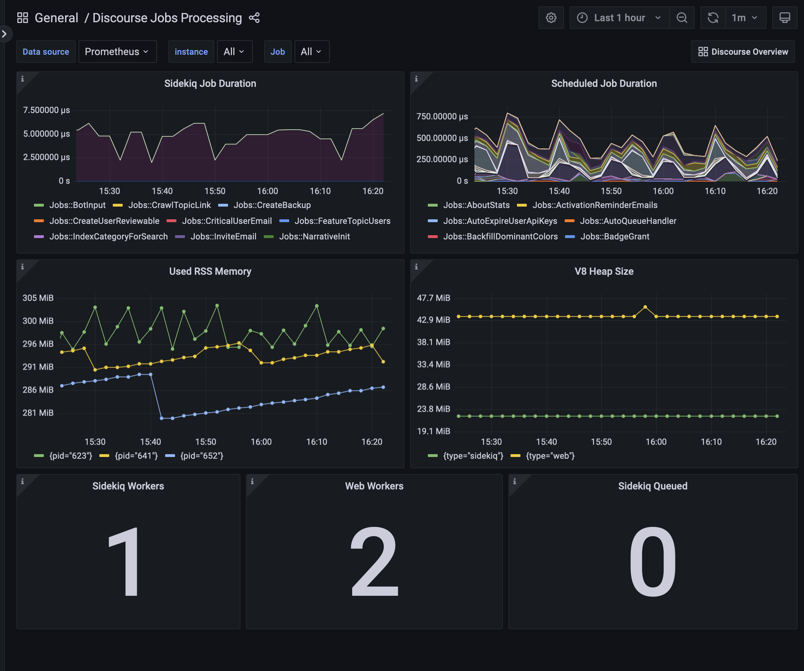

# Discourse Mixin

The [Discourse](https://meta.discourse.org/) mixin contains a variety of configurable Grafana dashboards and alerts that are sourced from the [Discourse Prometheus Metrics Plugin](https://github.com/discourse/discourse-prometheus).

The Discourse mixin contains the following dashboards:

- Discourse Overview
- Discourse Jobs Processing

The Discourse mixin contains the following alerts:

- DiscourseRequestsHigh5XXs
- DiscourseRequestsHigh4XXs

## Discourse Overview

The Discourse Overview dashboard highlights web traffic, underlying rails controller metrics, request activity, and pageviews. It also outlines some useful statistics surrounding latest median request latency for all the controllers that publish these.




## Discourse Jobs Processing

The Discourse Jobs Processing dashboard displays information about job duration and browser based memory usage. It also displays information about worker processes like `Sidekiq` and `Web` workers.



## Generating dashboards and alerts

```bash
make
```

Creates a generated `dashboards_out` directory and `prometheus_alerts.yaml` that can be imported into Grafana.

For more advanced uses of mixins, see [mixin documentation.](
https://github.com/monitoring-mixins/docs)
