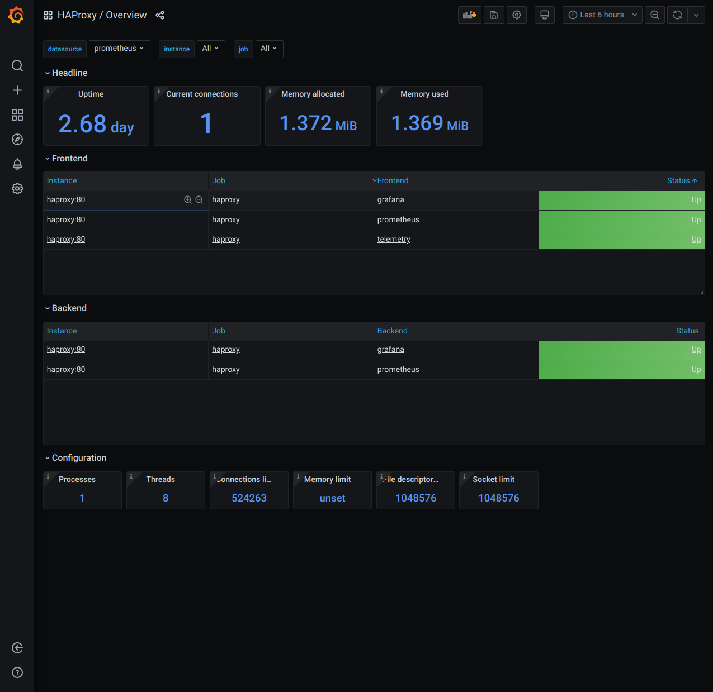
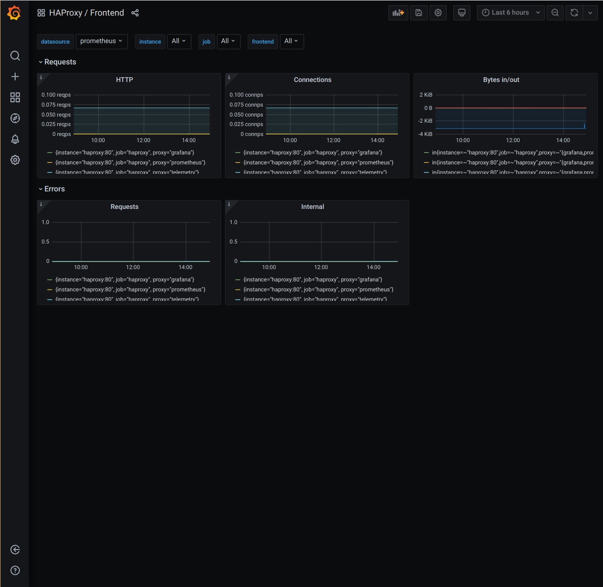
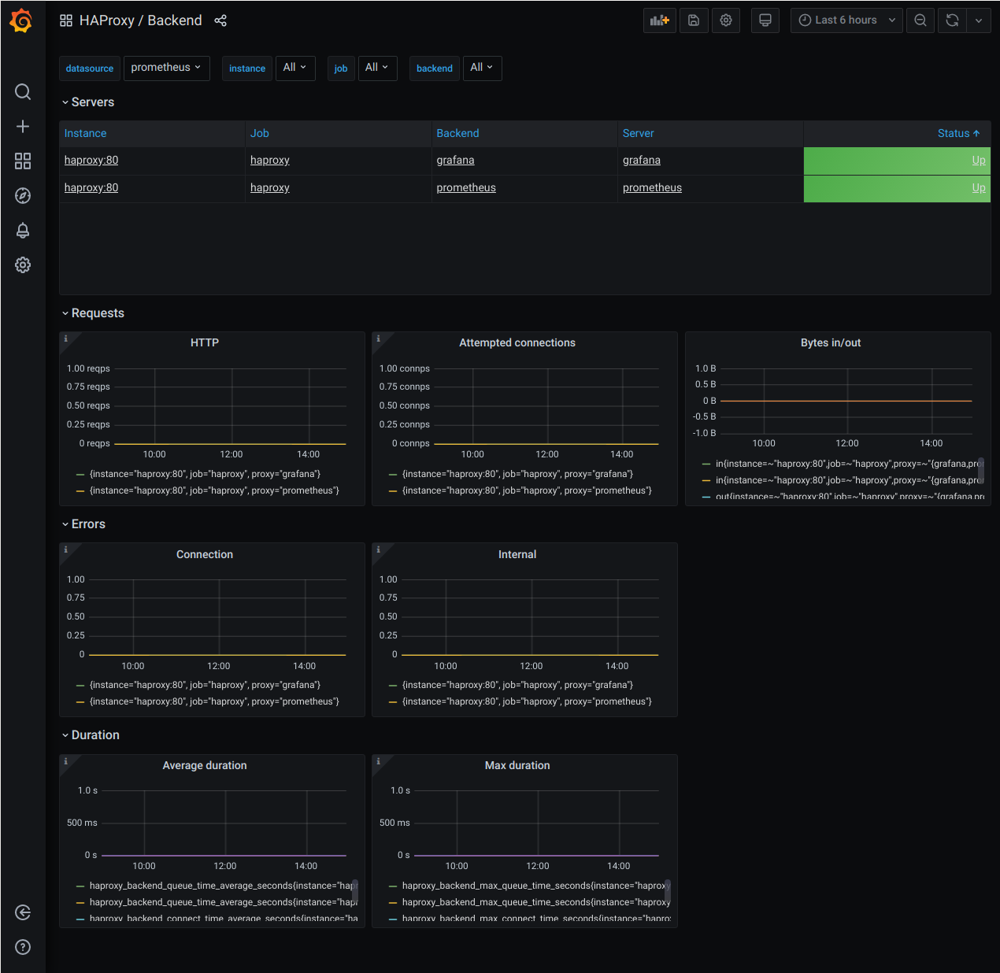
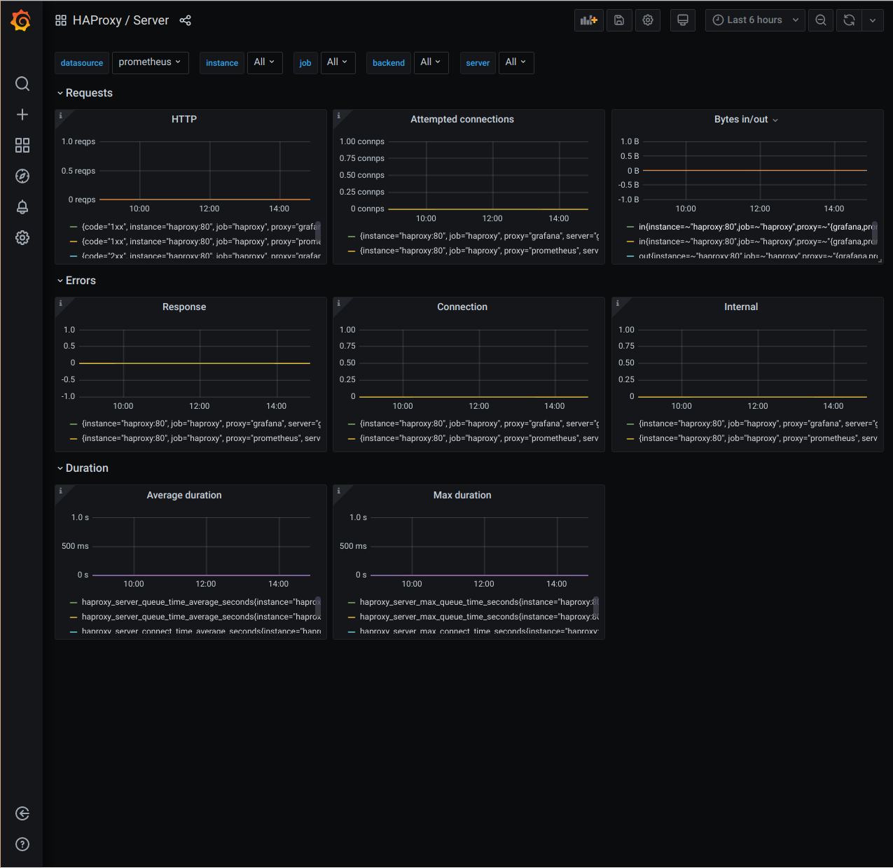

# HAProxy Mixin

The HAProxy Mixin is a set of configurable, reusable, and extensible alerts and dashboards based on the metrics exposed by the [HAProxy prometheus-exporter](https://github.com/haproxy/haproxy/tree/master/contrib/prometheus-exporter).
The mixin creates recording and alerting rules for [Prometheus](https://prometheus.io) and dashboard descriptions for [Grafana](https://grafana.com/).

## Dashboards

### HAProxy / Overview

### HAProxy / Frontend

### HAProxy / Backend

### HAProxy / Server

