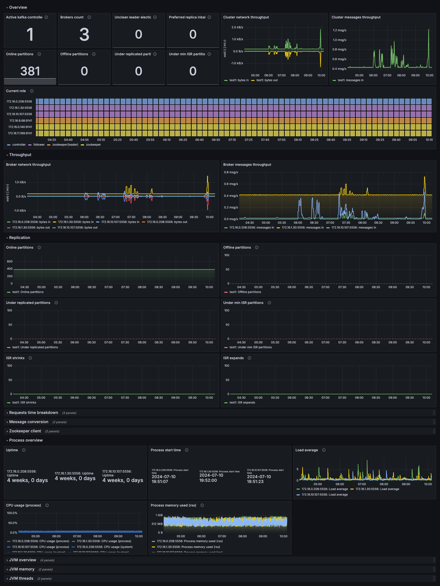

# Kafka observability library

This lib can be used to generate dashboards, rows, panels for Kafka signals.

The library supports two metrics sources (`metricsSource`):

- `prometheus`: JMX configs from [prometheus/jmx_exporter](https://github.com/prometheus/jmx_exporter/blob/main/example_configs/kafka-2_0_0.yml) and [kafka_exporter](https://github.com/danielqsj/kafka_exporter)
- `grafanacloud`: JMX configs from [kafka-mixin](../kafka-mixin/jmx) and [kafka_exporter fork](https://github.com/grafana/kafka_exporter) (used in grafana-agent/alloy).

You can also pick on the three JVM metrics sources (`jvmMetricsSource`):
  - `jmx_exporter` if you use jmx_exporter in http mode or javaagent mode with the additional config snippet (see README)
  - `prometheus_old` if you use jmx_exporter in javaagent mode and version prior to 1.0.1
  - `prometheus` if you use jmx_exporter in javaagent mode and version 1.0.1 or newer

If you pick `jmx_exporter` option, make sure you add the following snippet to your jmx_exporter config:

```yaml
lowercaseOutputName: true
lowercaseOutputLabelNames: true
rules:
  - pattern: java.lang<type=(.+), name=(.+)><(.+)>(\w+)
    name: java_lang_$1_$4_$3_$2
  - pattern: java.lang<type=(.+), name=(.+)><>(\w+)
    name: java_lang_$1_$3_$2
  - pattern : java.lang<type=(.*)>
```

## Import

```sh
jb init
jb install https://github.com/grafana/jsonnet-libs/kafka-observ-lib
```


## Example

Kafka broker overview dashboard:


Kafka topic overview dashboard:


Zookeeper overview dashboard:

