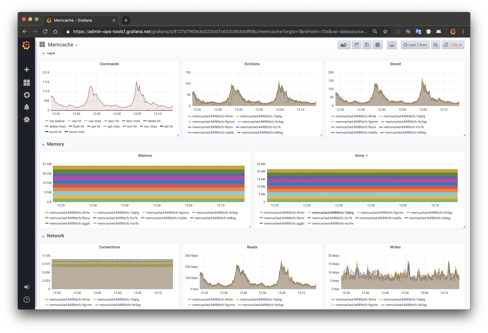

# Memcached Monitoring Mixin



Grafana dashboard for operating Memcached, in the form
of a monitoring mixin. They are easiest to use with the [prometheus-ksonnet](https://github.com/grafana/jsonnet-libs/tree/master/prometheus-ksonnet)
package.

To install this mixin, use [ksonnet](https://ksonnet.io/):

```sh
$ go get github.com/jsonnet-bundler/jsonnet-bundler/cmd/jb
$ jb install github.com/grafana/jsonnet-libs/memcached-mixin
```

Then to use, in your environment's `main.jsonnet` file:

```js
local prometheus = (import "prometheus-ksonnet/prometheus-ksonnet.libsonnet");
local memcached_mixin = (import "memcached-mixin/mixin.libsonnet");

prometheus + memcached_mixin {
  _config+:: {
    namespace: "default",
  },
}
```
