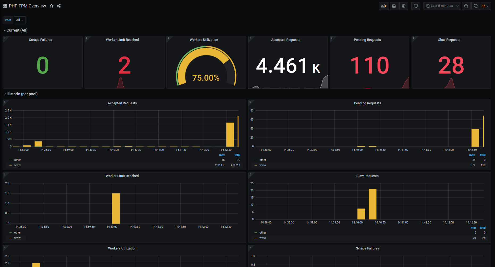

# PHP-FPM Mixin

The PHP-FPM Mixin is a set of configurable, reusable, and extensible alerts and dashboards based on the default metrics exported by [hipages/php-fpm_exporter](https://github.com/hipages/php-fpm_exporter). The mixin creates alerting rules for Prometheus and suitable dashboard descriptions for Grafana.

The dashboard took inspiration from the [Kubernetes PHP-FPM](https://grafana.com/grafana/dashboards/4912).

Dashboard preview:

