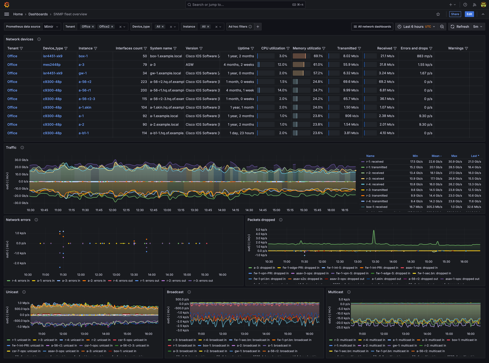
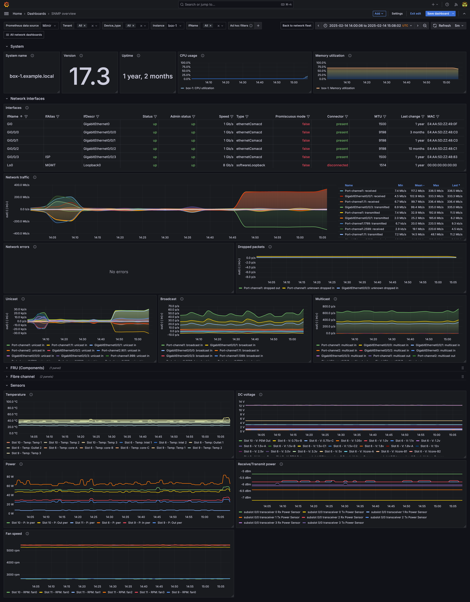
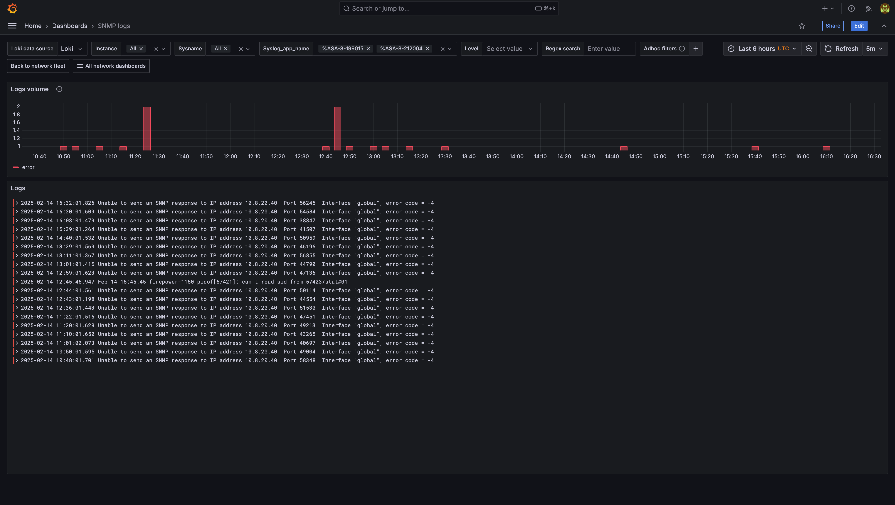

# SNMP observability library

This lib can be used to generate dashboards, rows, panels for SNMP devices.

The library supports multiple metrics sources that corresponds to different network vendors.

### Supported sources

|metricsSource|Description|MIBs|Known devices|Links|snmp_exporter modules|
|-|-|-|-|-|-|
|generic           |Generic SNMP device|IF-MIB,SNMPv2-MIB    |default choice||system,if_mib,hrDevice,hrStorage|
|cisco             | Cisco IoS devices |IF-MIB,SNMPv2-MIB, Cisco private mibs|Cisco C2900, Cisco C7600, Cisco MDS|-|system,if_mib,cisco_device,cisco_fc_fe|
|arista_sw            | Arista devices    |IF-MIB,SNMPv2-MIB,HOST-RESOURCES-MIB|-||system,if_mib,hrDevice,hrStorage,arista_sw|
|brocade_fcs       | Brocade           |IF-MIB,SNMPv2-MIB,SW-MIB|Brocade 6520 v7.4.1c, Brocade 300 v7.0.0c,Brocade BL 5480 v6.3.1c|https://techdocs.broadcom.com/us/en/fibre-channel-networking/fabric-os/fabric-os-mib/9-1-x/understanding-brocade-snmp/loading-brocade-mibs/brocade-mib-files.html|system,if_mib|
|brocade_foundry | Brocade Foundry | FOUNDRY-SN-AGENT-MIB | Brocade MLXe (System Mode: MLX), IronWare Version V5.4.0eT163, Foundry FLS648 Foundry Networks, Inc. FLS648, IronWare Version 04.1.00bT7e1, Foundry FWSX424 Foundry Networks, Inc. FWSX424, IronWare Version 02.0.00aT1e0||system,if_mib|
|dell_network | Dell Force S-Series, Dell Force10 MXL 10 | IF-MIB,SNMPv2-MIB,DELL-NETWORKING-CHASSIS-MIB | Dell Force S-Series |https://www.dell.com/support/kbdoc/en-us/000181922/dell-networking-mibs|system,if_mib,dell_network|
|dlink_des | D-Link DES series | IF-MIB,SNMPv2-MIB,AGENT-GENERAL-MIB | DGS-3420-26SC Gigabit Ethernet ||system,if_mib,dlink|
|eltex_mes | Eltex MES | IF-MIB, SNMPv2-MIB,ELTEX-MES-ISS-CPU-UTIL-MIB,ARICENT-ISS-MIB | MES 2448P ||system,if_mib,eltex_mes|
|extreme | ExtremeXOS | IF-MIB, SNMPv2-MIB,EXTREME-SYSTEM-MIB, EXTREME-SOFTWARE-MONITOR-MIB | - ||system,if_mib|
|f5_bigip | F5 BigIP | IF-MIB,SNMPv2-MIB,F5-BIGIP-SYSTEM-MIB | - |https://my.f5.com/manage/s/article/K13322|system,if_mib|
|fortigate | Fortinet Fortigate | IF-MIB,SNMPv2-MIB,FORTINET-FORTIGATE-MIB,ENTITY-MIB | v7.2.5 ||system,if_mib,hrDevice,hrStorage|
|hpe | HP Enterprise Switches | IF-MIB,SNMPv2-MIB,STATISTICS-MIB,NETSWITCH-MIB | HP ProCurve J4900B, HP J9728A 2920-48G | https://support.hpe.com/hpesc/public/docDisplay?sp4ts.oid=51079&docId=emr_na-c02597344|system,if_mib|
|huawei | Huawei VRP | IF-MIB,SNMPv2-MIB,HUAWEI-ENTITY-EXTENT-MIB | - |https://support.huawei.com/enterprise/en/doc/EDOC1000178181/2f6c0513/mib-overview |system,if_mib|
|juniper | Juniper MX, Juniper SRX | IF-MIB,SNMPv2-MIB,JUNIPER-MIB,JUNIPER-ALARM-MIB | Juniper MX204 Edge Router, JUNOS 24.2R1-S1.10, Juniper SRX, Juniper EX4200-24| https://www.juniper.net/documentation/us/en/software/nce/nce-srx-cluster-management-best/topics/concept/chassis-cluster-performance-monitoring.html |system,if_mib|
|mikrotik | Mikrotik OS | HOST-RESOURCES-MIB,SNMPv2-MIB,MIKROTIK-MIB,IF-MIB | Router OS 7.3 |912UAG-5HPnD,941-2nD,1100ahx2,CCR1016-12G,CCR1036-12G-4S,rb2011ua,mikrotik450g,mikrotikrb1100ah|system,if_mib,mikrotik,hrStorage,hrDevice|
|netgear | Netgear FastPath switches | SNMPv2-MIB,FASTPATH-SWITCHING-MIB,FASTPATH-BOXSERVICES-PRIVATE-MIB,IF-MIB | Netgear M5300-28G | https://kb.netgear.com/24352/MIBs-for-Smart-switches |system,if_mib,netgear|
|qtech | QTech | QTECH-MIB,EtherLike-MIB,HOST-RESOURCES-MIB,SNMPv2-MIB,ENTITY-MIB,IF-MIB | | |system,if_mib|
|tplink | TP-LINK | TPLINK-SYSINFO-MIB,HOST-RESOURCES-MIB,SNMPv2-MIB,TPLINK-SYSMONITOR-MIB,IF-MIB | T2600G-28TS | https://www.tp-link.com/en/support/download/t2600g-28ts/#MIBs_Files https://www.tp-link.com/ru/support/faq/1330/ |system,if_mib|
|ubiquiti_airos | Ubiquiti AirOS | FROGFOOT-RESOURCES-MIB,HOST-RESOURCES-MIB,SNMPv2-MIB,IEEE802dot11-MIB,IF-MIB | NanoStation M5, UAP-LR |  |system,if_mib,ubiquiti_airos|


## Usage

For detailed usage examples see [helloworld-observ-lib README](../helloworld-observ-lib/README.md).

### Import as a library

Import into another library or mixin:

```sh
jb init
jb install https://github.com/grafana/jsonnet-libs/snmp-observ-lib
```

Add jsonnet file:
```
local snmplib = import 'snmp-observ-lib/main.libsonnet';
local snmp =
  snmplib.new()
  + snmplib.withConfigMixin(
    {
        //override default configs:
        filteringSelector: 'job!=""',
        groupLabels: ['zone'],
        instanceLabels: ['target'],
        uid: 'snmp-sample',
        dashboardNamePrefix: 'Network',
        dashboardTags: ['networking'],
        // pick vendors you have:
        metricsSource: ['juniper','mikrotik'],
        enableLokiLogs: false,
    }
  );
snmp.asMonitoringMixin()
```


### As monitoring-mixin

You can quickly generate dashboards and alerts by using monitoring-mixin mixin.libsonnet:

- Adjust config.libsonnet to your needs. For example, pick metricSources that correspond to network vendors you use on your network.
- Run
```
make dashboards_out
make prometheus_alerts.yaml
```


### Logs support

Note: Logs support is enabled by default. To opt-out, set `enableLokiLogs: false` in the config before generating dashboards from this library.

This SNMP observability library can show syslog messages collected by alloy/rsyslog agents and stored in Grafana Loki.

In order to get syslog messages you need to do the following (example for cisco syslog):

1. Setup rsyslog agent with the following rsyslog.conf:

```
module(load="imudp")
#https://www.rsyslog.com/doc/master/configuration/modules/pmciscoios.html
module(load="pmciscoios")
# Pick your port to taste
input(type="imudp" port="30514" ruleset="withOrigin")
timezone(id="<yourtimezone>" offset="00:00")
# instead of -x
global(net.enableDNS="off")

$template raw,"%msg:2:2048%\n"

ruleset(name="common") {
       # Forward everything
       if ($fromhost-ip != "127.0.0.1" ) then action(type="omfwd"
              protocol=tcp target=localhost port=30514
              Template="RSYSLOG_SyslogProtocol23Format"
              TCP_Framing="octet-counted" KeepAlive="on"
              action.resumeRetryCount="-1"
              queue.type="linkedlist" queue.size="50000")
       *.*    /dev/stdout; raw
}

ruleset(name="withoutOrigin" parser="rsyslog.ciscoios") {
    /* this ruleset uses the default parser which was
     * created during module load
     */
    call common
}

parser(name="custom.ciscoios.withOrigin" type="pmciscoios"
       present.origin="on")
ruleset(name="withOrigin" parser="custom.ciscoios.withOrigin") {
    /* this ruleset uses the parser defined immediately above */
    call common
}
```

2. Setup alloy agent with the following snippet (adjust to your setup):

```
// LOGS
loki.write "default" {
    endpoint {
        url = "loki:3100"
    }
}

loki.source.api "default" {
    http {
        listen_address = "0.0.0.0"
        listen_port = 3500
    }
    forward_to = [
        loki.process.limit.receiver,
    ]
}
loki.process "limit" {
    stage.limit {
        rate  = 10000
        burst = 20000
        drop  = drop
        by_label_name = "hostname"
    }
    forward_to    = [
        loki.write.default.receiver,
    ]
}


// SYSLOG specific:
loki.source.syslog "default" {
  listener {
    address  = "0.0.0.0:30514"
    protocol = "tcp"
    use_incoming_timestamp = true
    labels   = { job = "syslog" }
  }

  forward_to = [loki.process.syslog.receiver]
  relabel_rules = loki.relabel.syslog.rules
}

loki.relabel "syslog" {
  forward_to = []

  rule {
    source_labels = ["__syslog_message_hostname"]
    target_label         = "sysname"
  }
  rule {
    source_labels = ["__syslog_message_hostname"]
    target_label         = "instance"
  }
  rule {
    source_labels = ["__syslog_message_app_name"]
    target_label         = "syslog_app_name"
  }
  rule {
    source_labels = ["__syslog_message_severity"]
    target_label         = "level"
  }
  rule {
    source_labels = ["__syslog_message_facility"]
    target_label         = "facility"
  }
  rule {
    source_labels = ["__syslog_message_msg_id"]
    target_label         = "syslog_msg_id"
  }
}
//cisco_rfc3164_logs
loki.process "syslog" {
    stage.match {
        // match only cisco unparsed logs like https://regex101.com/r/v0MyiB/6
        // from ASA or NX-OS
        selector = `{instance!=""} |~ "<\\d+>.+%.+"`
        stage.regex {
          expression = `<\d+?>((?P<sysname>[a-zA-Z0-9\-\.]+):)?(?P<date_and_other>.+): (?P<appname>%.+?): (?P<msg>.+)`
        }
        stage.labels {
          values = {
              sysname = "",
              syslog_app_name = "appname",
          }
        }
        stage.output {
          source   = "msg"
        }
    }

    forward_to    = [loki.process.limit.receiver]
}

```

3. Setup syslog at the device side according to vendor docs

For cisco devices, set origin option: `logging origin-id hostname`.

4. Get syslog messages on the separate dashboard and as dashboard annotations for critical events collected.

## Examples
SNMP fleet:


SNMP overview:


SNMP logs:

