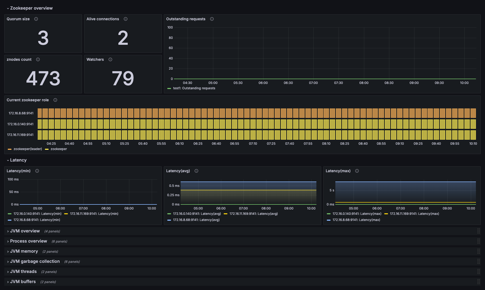

# ZooKeeper observability library

This lib can be used to generate dashboards, rows, panels for ZooKeeper signals.

The library supports metricsSources:

- `prometheus`: Prometheus metrics available natively in ZooKeeper since 3.6.0: https://zookeeper.apache.org/doc/r3.7.0/zookeeperMonitor.html
- `grafanacloud`: JMX configs from [kafka-mixin](../kafka-mixin/jmx)

## Import

```sh
jb init
jb install https://github.com/grafana/jsonnet-libs/zookeeper-observ-lib
```

## Example


